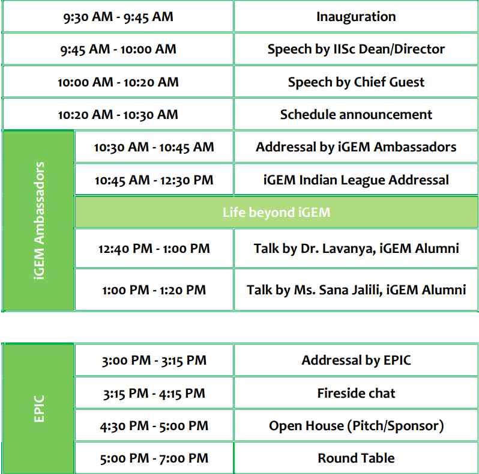
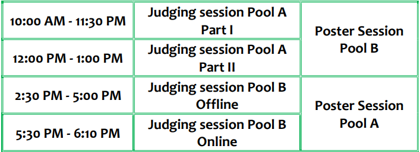
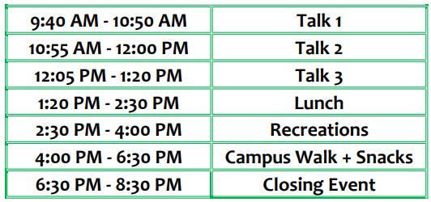

# Welcome to AIIM 2022
After a long pandemic full of virtual meetups, AIIM is back offline this year at Indian Institute of Science, Bengaluru. 
**Venue**: Faculty Hall, Main Building, Indian Institute of Science Bengaluru, Karnataka India-560012 

## What is AIIM?
All India iGEM Meet (AIIM) is a three-day regional conference from 23rd to 25th July 2022. Since its initiation in 2015, AIIM has provided a platform for the Indian iGEM teams to discuss, collaborate and hone their presentation skills while learning something new from experts in the field. It is most renowned for its mock jamboree-style presentation and judging sessions, where teams get a chance to learn about other teams' work and forge potential partnerships, while getting critique and constructive advice on making their projects better.

### What is iGEM?

The International Genetically Engineered Machine (iGEM) competition is a worldwide synthetic biology competition initially aimed at undergraduate university students but has since expanded to include divisions for high school students, entrepreneurs, and community laboratories, as well as 'over-graduates' initiated by MIT’s Independent Activities period.

## Participants

In this edition of AIIM, we have the following participants:

- Delegates from 14 iGEM Teams from all over India
- iGEM India and Asia Ambassadors
- iGEM Entrepreneurship Program and Innovation Community 
- Professors, Researchers from all fields of Biology
- Alumni of iGEM

### About the Teams and Participants!

- **iGEM Grand Jamboree Teams**: The set of teams participating is quite diverse this year, ranging from reputed government to private institutions including _IISc_, _IISERs_, _IITs_, _REC Chennai_, _ICT Mumbai_, and _VIT Vellore_. 
- **iGEM Ambassadors**: The iGEM Ambassadors comprises a team of passionate regional leaders who have experienced iGEM and now work together to promote initiatives to expand the competition and collaborate with local stakeholders to disseminate cooperation across their community. 
- **EPIC (Entrepreneurship Program and Innovation Community) Members**: The Entrepreneurship Program Innovation Community (EPIC) supports the development of iGEM's entrepreneurial community, with an aim to become the driving force behind hundreds of SynBio based start-ups globally to help accelerate our transition to a more 
sustainable bioeconomy. 
- **WiSTEM (Women in STEM)**: The WiSTEM Initiative was launched in August 2020 with the goal of representing and empowering all women in STEM and synthetic biology across the globe. 
- **Phoenix project members**: The team aims to increase the number of projects that live on beyond their initial iGEM cycle by bridging the gap between the teams that have previously worked on and will be working on similar topics.

## Schedule of the Event

### Day 1

### Day 2

**Judging Panel**:
 - Judge 1: [Tapan Chandra Adhyapak](http://www.iisertirupati.ac.in/faculty/adhyapak/adhyapak.php), Assistant Professor, IISER Tirupati 
 - Judge 2: To be added soon!

**Poster Presentation Judges**:
- To be added soon!

### Day 3

**Prospective Professors for Talks**:
- [Dr. Pranal Chandra](https://www.chandraslab.com/dr-pranjal-chandra), Assistant Professor, IIT (BHU) Varanasi
- [Dr. Ramray Bhat](https://mrdg.iisc.ac.in/ramray-bhat/), Associate Professor. IISc Bengaluru
- [Dr. Bhushan Toley](https://chemeng.iisc.ac.in/chemeweb/faculty_bhushan.htm),  Assistance Professor IISc Bengaluru and Co-founder Papyrus Diagnosics Pct. Ltd.
- [Dr. Sumanta Bagchi](https://ces.iisc.ac.in/?q=user/85), Associate Professor IISc Bengaluru

## Highlights

- **Day 1**
  - Chief Guest: 
  - iGEM Alumni Talk 
  - WiSTEM 
  - Fireside Chat 
  - Round Table
- **Day 2**
  - Judging Session
  - Poster Presentations 
  - Off-campus Dinner
- **Day 3**
  -Talks by Professors from various backgrounds 
(Will be updated soon!) 
- **Recreations**
  - _The Gene Auction_ —an auction where teams will engage in bidding for genes for their organisms at each stage for survival! 

## Participating Teams

- IISc Bengaluru
- ICT Mumbai
- IISER Berhampur
- IISER Tirupati
- IISER TVM
- IISER Pune 1
- IISER Pune 2
- IIT Roorkee
- IIT Delhi
- MIT Mahe
- VIT Vellore
- IISER Mohalli
- IISER Bhopal
- REC Chennai

- iGEM Phoenix Project
- iGEM Ambassador Program
- iGEM EPIC
- iGEM Community
- Women in STEM (WiSTEM)

### Support or Contact

Do you have any queries or wish to contact us? Feel free to drop an [email](mailto:igem.ug@iisc.ac.in). If you are looking to sponsor us, please send us an [email](mailto:igem.ug@iisc.ac.in).
