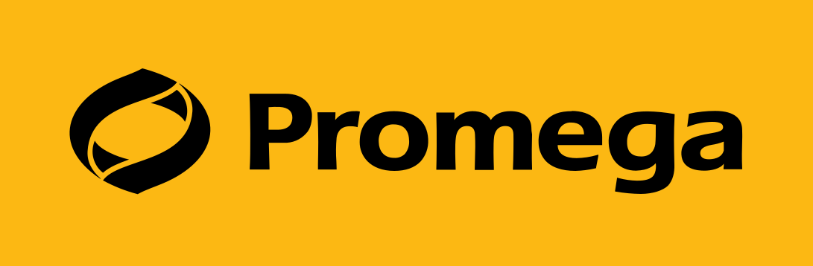
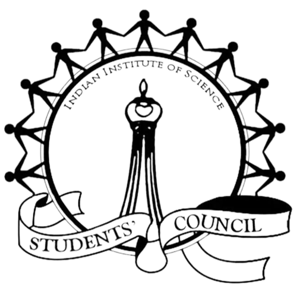

 <h1>Welcome to <a href="https://igem-iisc.github.io/AIIM2022/"> AIIM 2022</a></h1>

After a long pandemic full of virtual meetups, AIIM is back offline this year at Indian Institute of Science, Bengaluru.

**Venue**: Faculty Hall, Main Building, Indian Institute of Science Bengaluru, Karnataka India-560012 

## What is AIIM?
All India iGEM Meet (AIIM) is a three-day regional conference from 23rd to 25th July 2022. Since its initiation in 2015, AIIM has provided a platform for the Indian iGEM teams to discuss, collaborate and hone their presentation skills while learning something new from experts in the field. It is most renowned for its mock jamboree-style presentation and judging sessions, where teams get a chance to learn about other teams' work and forge potential partnerships, while getting critique and constructive advice on making their projects better.

### What is iGEM?

The International Genetically Engineered Machine (iGEM) competition is a worldwide synthetic biology competition initially aimed at undergraduate university students but has since expanded to include divisions for high school students, entrepreneurs, and community laboratories, as well as 'over-graduates' initiated by MIT’s Independent Activities period.

## Participants

In this edition of AIIM, we have the following participants:

- Delegates from 14 iGEM Teams from all over India
- iGEM India and Asia Ambassadors
- iGEM Entrepreneurship Program and Innovation Community 
- Professors, Researchers from all fields of Biology
- Alumni of iGEM

### About the Teams and Participants!

- **iGEM Grand Jamboree Teams**: The set of teams participating is quite diverse this year, ranging from reputed government to private institutions including _IISc_, _IISERs_, _IITs_, _REC Chennai_, _ICT Mumbai_, and _VIT Vellore_. 
- **iGEM Ambassadors**: The iGEM Ambassadors comprises a team of passionate regional leaders who have experienced iGEM and now work together to promote initiatives to expand the competition and collaborate with local stakeholders to disseminate cooperation across their community. 
- **EPIC (Entrepreneurship Program and Innovation Community) Members**: The Entrepreneurship Program Innovation Community (EPIC) supports the development of iGEM's entrepreneurial community, with an aim to become the driving force behind hundreds of SynBio based start-ups globally to help accelerate our transition to a more 
sustainable bioeconomy. 
- **WiSTEM (Women in STEM)**: The WiSTEM Initiative was launched in August 2020 with the goal of representing and empowering all women in STEM and synthetic biology across the globe. 
- **Phoenix project members**: The team aims to increase the number of projects that live on beyond their initial iGEM cycle by bridging the gap between the teams that have previously worked on and will be working on similar topics.

## Schedule of the Event

### Day 1

| **Timing** | **Event** |
| :------: | :------: |
| **9:30 AM - 9:45 AM** | **Inaugration** |
| **9:45 AM - 10:00 AM** | **Speech by Dean/Director** |
| **10:00 AM - 10:20 AM** | **Speech by Chief Guest** |
| **10:20 AM - 10:30 AM** | **Schedule Announcement** |
| **10:30 AM - 10:45 AM** | **Addressal by iGEM Ambassadors** |
| **10:45 AM - 12:30 PM** | **iGEM Indian League Addressal** |
| **12:30 PM - 12:40 PM** | **Life Beyond iGEM** |
| **12:40 PM - 1:00 PM** | **Talk by Dr. Lavanya, iGEM Alumni** |
| **1:00 PM - 1:20 PM** | **Talk by Ms Sana Jalili, iGEM Alumni** |
| **1:20 PM - 3:00 PM** | **Lunch** |
| **3:00 PM - 3:15 PM** | **Addressal by EPIC** |
| **3:15 PM - 4:15 PM** | **Fireside Chat** |
| **4:30 PM - 5:00 PM** | **Open House** |
| **5:00 PM - 7:00 PM** | **Round Table** |

### Day 2

| **Timing** | **Event** |
| :------: | :------: |
| **9:30 AM - 10:15 AM**| **Talk by Dr. Ramray Bhat** |
| **10:30 AM - 1:00 PM** | **Judging Session Part I** |
| **1:00 PM - 2:30 PM** | **Lunch** |
| **2:30 PM - 6:10 PM** | **Juding Session Part II** |
| **7:00 PM onwards** | **Recreations + Dinner at Banquet Hall** |

<h4>Details about the Judging Session:</h4>

| **Timing** | **Mock Judging** | **Poster Presentation** |
| :------: | :------: | :------: |
| **10:00 AM - 11:30 AM** | **Pool A Part I** | **Pool B** |
| **12:00 PM - 1:00 PM** | **Pool A Part II** | **Pool B** |
| **2:30 PM - 5:00 PM** | **Pool B Part I** | **Pool A** |
| **5:30 PM - 6:10 PM** | **Pool B Part II** | **Pool A** |

**Judging Panel**:

Session 1:

 

 
Judge 1: <a href="http://www.iisertirupati.ac.in/faculty/adhyapak/adhyapak.php">Dr Tapan Chandra Adhyapak</a>, Assistant Professor, IISER Tirupati 

 
<b>Position:</b> Assistant Professor 
<b>Affiliation:</b> Department of Physics, IISER Tirupati 
<b>Research Interests:</b> Physics of Active Particles, Nonequilibirium Statistical Physics, Driven Soft Biological Systems 
 

 

Judge 2: <a href="https://iisc.ac.in/arting-science/dr-bitasta-das/">Dr Bitasta Das</a>

 

<b>Position:</b> Senior Editorial Assistant and UG-Instructor (Humanities) 
<b>Affiliation:</b> Indian Institute of Science, Bengaluru 
  
 

 

Judge 3: <a href="https://www.ibab.ac.in/research/vijayalakshmi-mahadevan/">Dr Vijayalakshmi Mahadevan</a>

<b>Position:</b> Professor, Epigenetics and Image Informatics 
<b>Affiliation:</b> Institute of Bioinformatics and Applied Biotechnology, BioTech Park, Bengaluru 
<b>Research Interests:</b> Chromatin and Epigenetics, Disease Epigenetics, p53 mutations in cancer, epigenetic inhibitors, cancer epigenetics, imaging, machine learning 
  

 

Session 2:
 

Judge 1: <a href="http://www.iisertirupati.ac.in/faculty/adhyapak/adhyapak.php">Dr Tapan Chandra Adhyapak</a>

<b>Position:</b> Assistant Professor 
<b>Affiliation:</b> Department of Physics, IISER Tirupati 
<b>Research Interests:</b> Physics of Active Particles, Nonequilibirium Statistical Physics, Driven Soft Biological Systems 
 

 

Judge 2: <a href="https://iisc.ac.in/arting-science/dr-bitasta-das/">Dr Bitasta Das</a>

 
<b>Position:</b> Senior Editorial Assistant and UG-Instructor (Humanities) 
<b>Affiliation:</b> Indian Institute of Science, Bengaluru 
 

   

Judge 3: <a href="https://biochem.iisc.ac.in/kesavardana-sannula.php">Dr Kesavarsdhana Sannula</a>

<b>Position:</b> Assistant Professor 
<b>Affiliation:</b> Department of Biochemistry, Indian Institute of Science, Bengaluru 
<b>Research Interests:</b> Mechanisms of Innate Immune Sensing, Inflammation and Cell Death; How RNA Virus-Host interactions determine host-specific immunopathology or immune tolerance; evolution of immune evasion traits in RNA viruses 
 

 

### Day 3

| **Timing** | **Event** |
| :------: | :------: |
| **9:40 AM - 10:50 AM** | **Talk 1: Dr Pranjal Chadra IIT BHU** |
| **10:55 AM - 12:00 PM** | **Talk 2: Dr Varsha Jaisimha** |
| **12:05 PM - 1:20 PM** | **Talk 3** |
| **1:20 PM - 2:30 PM** | **Lunch** |
| **2:30 PM - 4:00 PM** | **Recreations** |
| **4:00 PM - 6:30 PM** | **Campus Walk + Snacks** |
| **6:30 PM - 8:30 PM** | **Closing Event** |

## Speakers for AIIM 2022:

 <a href="https://www.linkedin.com/in/lavanya-bhagavatula-8ba52442">Dr Ramray Bhat</a>

 
<b>Position:</b> Assistant Professor 
<b>Affiliation:</b> Molecular Reproduction, Development and Genetics (MRDG) Indian Institute of Science
<b>Research Interests:</b> Morphogenesis, cancer progression
 

 <a href="https://www.linkedin.com/in/lavanya-bhagavatula-8ba52442">Dr Pranjal Chandra</a>

 
<b>Position:</b> Assistant Professor & Ramanujan Fellow 
<b>Affiliation:</b> School of Biochemical Engineering, Indian Institute of Technology (BHU) Varanasi; Fellow, Indian Chemical Society 
<b>Research Interests:</b> Sensing Technology, Nano-Biotechnology, and Material Science to provide pertinent solutions to healthcare
 

 <a href="https://www.linkedin.com/in/lavanya-bhagavatula-8ba52442">Dr Lavanya Bhagavatula</a>

 
iGEM Ambassador 
Member of After iGEM  

 <a href="https://www.linkedin.com/in/sana-jalili-aa122470">Ms Sana Jalili</a>

 
iGEM Ambassador 
iGEM Friendzymes 2021  

## Highlights

- **Day 1**
  - Chief Guest: 
  - iGEM Alumni Talk 
  - WiSTEM 
  - Fireside Chat 
  - Round Table
- **Day 2**
  - Judging Session
  - Poster Presentations 
  - Off-campus Dinner
- **Day 3**
  -Talks by Professors from various backgrounds 
(Will be updated soon!) 
- **Recreations**
  - _The Gene Auction_ —an auction where teams will engage in bidding for genes for their organisms at each stage for survival! 

## Participating Teams

- IISc Bengaluru
- ICT Mumbai
- IISER Berhampur
- IISER Tirupati
- IISER TVM
- IISER Pune 1
- IISER Pune 2
- IIT Roorkee
- IIT Delhi
- MIT Mahe
- VIT Vellore
- IISER Mohalli
- IISER Bhopal
- REC Chennai

- iGEM Phoenix Project
- iGEM Ambassador Program
- iGEM EPIC
- iGEM Community
- Women in STEM (WiSTEM)

## Our Sponsors!

## Support or Contact

Do you have any queries or wish to contact us? Feel free to drop an [email](mailto:igem.ug@iisc.ac.in). If you are looking to sponsor us, please send us an [email](mailto:igem.ug@iisc.ac.in).
